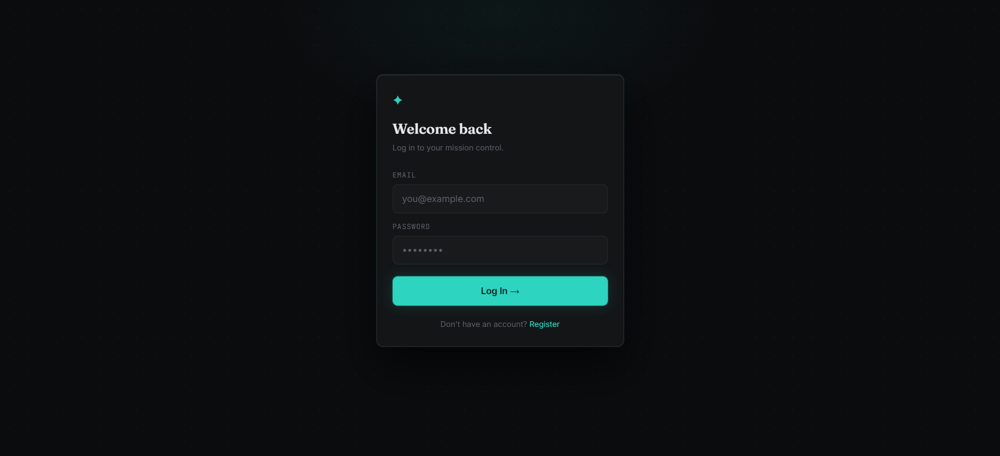
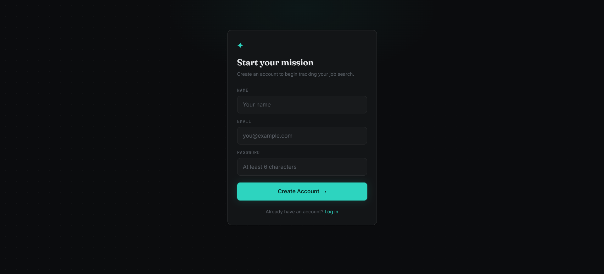
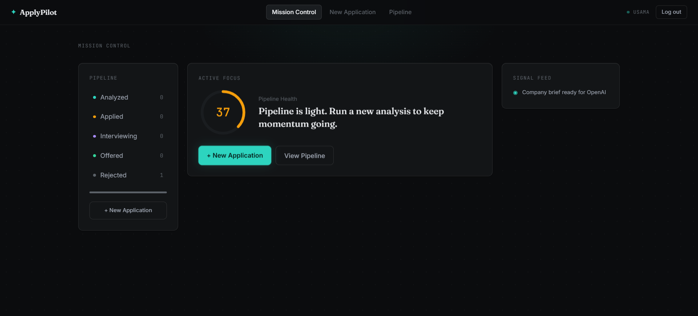
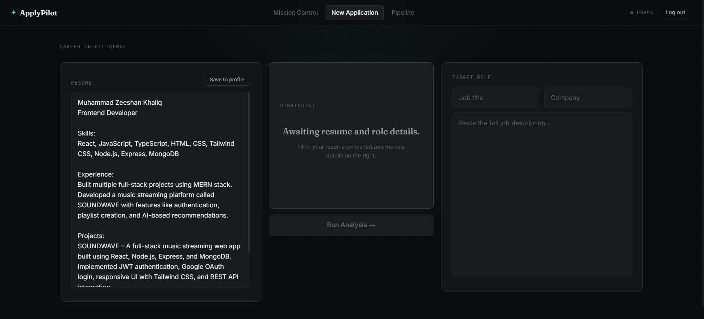
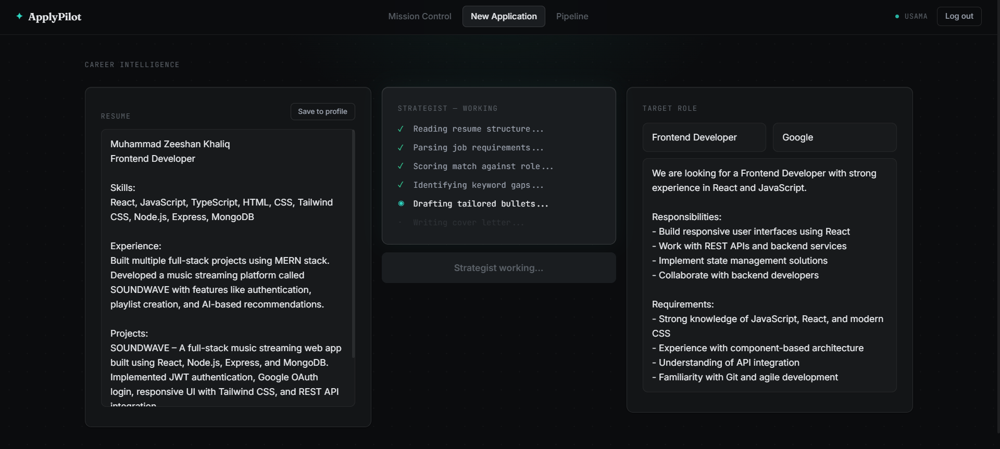
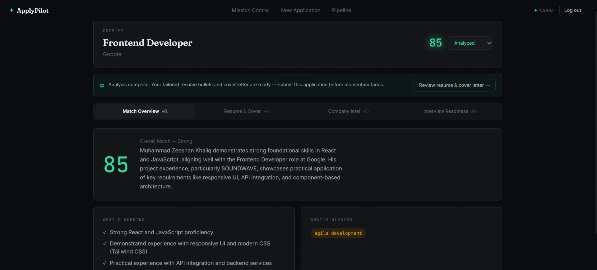
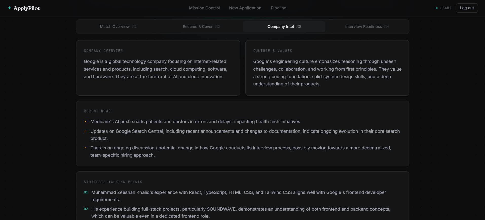

# 🚀 ApplyPilot — AI Job Application Co-Pilot

<p align="center">
  <strong>An AI-Powered Job Search Operating System built with the MERN Stack.</strong>
</p>

<p align="center">
  Resume Intelligence • Autonomous Company Research • Interview Preparation • Application Tracking
</p>

<p align="center">
  
  
  
  
  
  
</p>

---

## ✨ Overview

ApplyPilot is a full-stack AI-powered job application operating system designed to help job seekers move through the entire application lifecycle—not just one isolated step.

Most tools focus on a single problem:

* Resume scoring
* Cover letter generation
* Application tracking
* Interview preparation

ApplyPilot combines all of them into one connected workflow.

Users can:

✅ Analyze resume-job fit

✅ Generate tailored resume bullets

✅ Generate personalized cover letters

✅ Research companies using an autonomous AI agent

✅ Prepare for interviews

✅ Track applications through the hiring pipeline

✅ Monitor job search momentum through a centralized dashboard

---

## 🎯 The Problem

Modern job hunting is fragmented.

A single application often requires:

* Resume tailoring
* Cover letter writing
* Company research
* Interview preparation
* Application tracking

Most platforms solve only one piece of this workflow.

ApplyPilot was built to create a unified system where every stage of the application process is connected.

---

# 🧠 Core Innovation

## AI Research Agent

Unlike traditional AI applications that rely on a single prompt-response interaction, ApplyPilot implements a genuine tool-using AI agent.

The agent:

1. Receives a target company
2. Decides what information it needs
3. Uses web search tools autonomously
4. Analyzes results
5. Performs additional searches when necessary
6. Produces structured intelligence reports

### Agent Workflow

```text
User Input
    ↓
AI Agent
    ↓
Tool Call Decision
    ↓
Tavily Search
    ↓
Search Results
    ↓
Reasoning
    ↓
Additional Searches
    ↓
Structured Intelligence Report
```

The final report includes:

* Company Overview
* Recent News
* Company Culture Insights
* Interview Preparation Questions
* Strategic Talking Points

---

# ⚙️ Key Features

## 1️⃣ Career Intelligence Workspace

Analyze a resume against a job description and generate:

* Match Score (0–100)
* Match Quality Assessment
* Resume Strengths
* Missing Keywords
* Tailored Resume Bullets
* Personalized Cover Letter
* Strategic Fit Summary

### Progressive AI Processing

Instead of showing a loading spinner, ApplyPilot displays a live strategist log:

```text
✓ Parsing Resume
✓ Analyzing Job Description
✓ Calculating Match Score
✓ Identifying Skill Gaps
✓ Generating Resume Improvements
✓ Writing Cover Letter
```

This creates a transparent AI experience.

---

## 2️⃣ Autonomous Company Research

The platform's flagship feature.

Generate:

* Company Overview
* Recent News Analysis
* Company Culture Insights
* Hiring Signals
* Role-Specific Interview Questions
* Interview Coaching Tips

Powered by:

* OpenRouter
* Google Gemini
* Tavily Search

---

## 3️⃣ Application Dossier

Every analyzed application becomes a persistent intelligence record.

### Match Overview

* Match Score
* Summary
* Strengths
* Skill Gaps

### Resume & Cover

* Editable Resume Bullets
* Editable Cover Letter

### Company Intelligence

* Research Agent Output

### Interview Readiness

* Interview Questions
* Readiness Score

---

## 4️⃣ Application Pipeline

Track applications through:

```text
Analyzed
   ↓
Applied
   ↓
Interviewing
   ↓
Offered
   ↓
Rejected
```

Features:

* Application Portfolio View
* Pipeline Health Tracking
* Momentum Signals
* Follow-Up Recommendations
* Status Management

---

## 5️⃣ Mission Control Dashboard

A command-center style dashboard providing:

* Pipeline Health Score
* Priority Tasks
* Active Interviews
* Applications Requiring Attention
* Activity Feed

Designed to surface the most important next action.

---

## 6️⃣ Secure Authentication

Features:

* JWT Authentication
* Password Hashing (bcrypt)
* Protected Routes
* User-Specific Data Isolation
* Secure API Middleware

Every application is scoped to its owner at the database level.

---

## 7️⃣ Resume Profile Persistence

Store your resume once.

Future analyses automatically preload your saved resume to eliminate repetitive data entry.

---

## 8️⃣ Resilient AI Error Handling

ApplyPilot classifies AI failures into meaningful categories:

* Provider Errors
* Rate Limits
* Malformed JSON
* Incomplete Agent Runs

Automatic retry mechanisms improve reliability and user experience.

---

# 🎨 Design Philosophy

Inspired by:

* Bloomberg Terminal
* Linear
* Perplexity

Design Characteristics:

* Graphite Dark Theme
* Teal Intelligence Accent
* Status-Based Color System
* Serif Editorial Headlines
* Monospaced Data Displays
* Custom Motion System
* Custom Component Library

No external UI component libraries were used.

Every interface element was built from scratch.

---

# 🏗️ System Architecture

## Frontend

* React
* Vite
* React Router
* Context API
* Custom CSS Design System

## Backend

* Node.js
* Express.js
* MVC Architecture

## Database

* MongoDB Atlas
* Mongoose ODM

## Authentication

* JWT
* bcryptjs

## AI Layer

* OpenRouter API
* Google Gemini
* Tavily Search API

---

## Backend Architecture

```text
Routes
   ↓
Controllers
   ↓
Services
   ↓
Models
   ↓
MongoDB
```

---

## AI Architecture

```text
Frontend
    ↓
REST API
    ↓
AI Service Layer
    ↓
OpenRouter
    ↓
Gemini
    ↓
Tool Calls
    ↓
Tavily Search
```

---

# 📸 Screenshots

## Login



---

## Register



---

## Mission Control Dashboard



---

## Career Intelligence Workspace



---

## Resume Analysis



---

## Resume Analysis Results


---

## Application Dossier



---

## Application Dossier — Resume & Cover Letter


---

## AI Research Agent


---

## Company Intelligence



---

## Interview Preparation

```


# 🔐 Security Considerations

ApplyPilot enforces:

* Password Hashing
* JWT Authentication
* Protected API Routes
* User Data Isolation
* Environment Variable Protection

Database queries always scope records by:

```javascript
{
  _id: applicationId,
  userId: authenticatedUserId
}
```

preventing unauthorized access.

---

# 🚀 Getting Started

## Clone Repository

```bash
git clone https://github.com/Zeeshan0991/ApplyPilot-AI-Job-Copilot.git
cd ApplyPilot-AI-Job-Copilot
```

---

## Backend Setup

```bash
cd server
npm install
npm run dev
```

---

## Frontend Setup

```bash
cd client
npm install
npm run dev
```

---

# 🔑 Environment Variables

### Server

```env
PORT=5000

MONGO_URI=

JWT_SECRET=

OPENROUTER_API_KEY=

TAVILY_API_KEY=
```

---

# 🛣️ Future Roadmap

### Planned Features

* LinkedIn Job Import
* Indeed Job Import
* ATS Optimization Engine
* Company Knowledge Memory
* Job Search Analytics
* Application Success Tracking
* AI Follow-Up Email Generation
* Calendar Integration
* Multi-Agent Collaboration
* Browser Extension

---

# 👨‍💻 Author

### Tehfeez Sadik

AI Engineer • Full Stack Developer • MERN Stack Developer

Built to explore the intersection of:

* Full-Stack Engineering
* AI Systems
* Agentic Workflows
* Career Intelligence Platforms

---

<p align="center">
  <strong>Apply smarter. Research deeper. Interview better.</strong>
</p>

<p align="center">
  🚀 ApplyPilot
</p>
